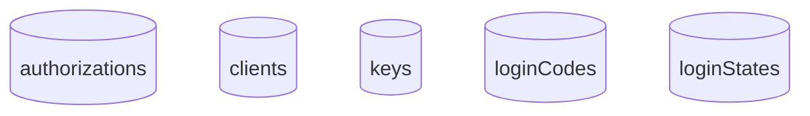

# Firestore

GCP Firestore provides a managed NoSQL option for storing the client and authorization data.

## Collections

The following collections are used by the firestore data store:

## Configuration

This module is enabled by setting the `SPRING_PROFILES_ACTIVE` to include the profile `datamodel-firestore`.

The following environment variables are used by the Firestore module:

| Environment Variable | Required | Description      |
| -------------------- | -------- | ---------------- |
| GOOGLE_CLOUD_PROJECT | Yes      | GCP Project name |
