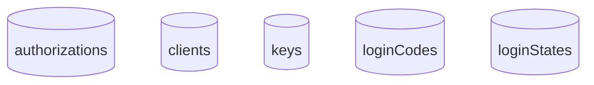

# Firestore

GCP Firestore provides a managed NoSQL option for storing the client and authorization data.

## Collections

The following collections are used by the firestore data store:

```mermaid
flowchart TD
    authorizations[(authorizations)]
    clients[(clients)]
    keys[(keys)]
    loginCodes[(loginCodes)]
    loginStates[(loginStates)]
```
