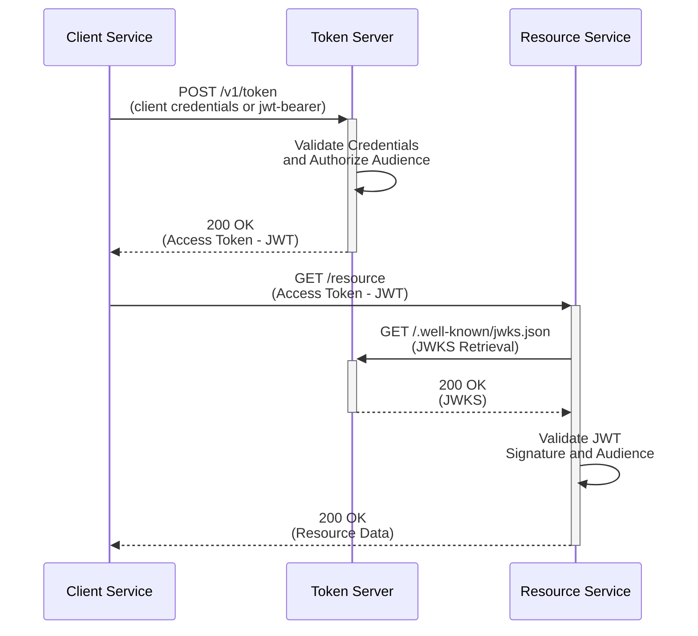

# Getting Started

Once the ServiceAuthCentral token service is deployed, you can start integrating your services with it.  This guide will walk through the steps to integrate a `Client Service` which to request an access token from the `Token Server` to access a `Resource Service` which will then validate the token.

## Client Service

A Client Service is responsible for requesting an access token from the Token Server to access a Resource Service. It must be able to send HTTP requests to both the Token Server (to obtain the access token) and the Resource Service (to access protected resources using that token).

In ServiceAuthCentral, each client is assigned a specific identity (clientId) and authorized to access resource services based on the audience. When the Client Service requests an access token using the JWT-bearer flow (or the client credentials flow if necessary), ServiceAuthCentral ensures both authentication and authorization for the requested audience and scopes. The issued access token is a JWT containing claims that define the authorized actions for the client. By eliminating shared secrets, each client retains its own identity, ensuring secure interactions without reliance on traditional credential mechanisms.

## Token Server (ServiceAuthCentral)

ServiceAuthCentral acts as a robust authorization server, going beyond basic OAuth 2.0 functionality. It centralizes authorization by verifying both the client’s identity and its permissions to access the requested audience and scopes. Tokens are only issued if the client is explicitly authorized, enforcing strict control over access. This emphasis on authorization—rather than just authentication—sets ServiceAuthCentral apart from typical OAuth servers.

A unique aspect of ServiceAuthCentral is that every clientId can function both as a client and a resource server, promoting a unified identity across the infrastructure. With a preference for JWT-bearer authentication and the avoidance of shared secrets, ServiceAuthCentral provides a secure, streamlined access control solution between various services.

## Resource Service

A Resource Service is a protected endpoint that validates and authorizes incoming requests using JWT access tokens issued by ServiceAuthCentral. The service validates the JWT’s signature using the public keys provided by the ServiceAuthCentral JWKS endpoint (/.well-known/jwks.json).

Crucially, the Resource Service verifies that the client is both authenticated and authorized for the requested audience and scopes. Since ServiceAuthCentral only issues tokens to clients authorized for specific audiences, this process ensures secure, scope-limited access. With each client authenticated via the JWT-bearer flow and no need for shared secrets, the Resource Service can confidently verify the client’s identity and authorized scope, providing seamless access control within the ServiceAuthCentral ecosystem.
