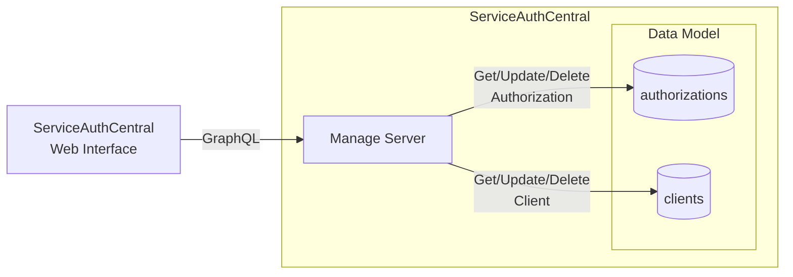

# Manage Server

The manage server provides the control plane for ServiceAuthCentral in the form of a GraphQL endpoint for managing the authorization server.



## Build Manage Server Docker Image

Both the manage and token service are compiled from the same repository git repository and Dockerfile. The command to build the manage server requires the correct build-arg to be passed in to generate the docker container for the manage server components.

```
docker build -f Dockerfile --build-arg MAVEN_PROFILE=auth-server-manage -t serviceauthcentral/auth-server-manage .
```

## Run Manage Server Using Docker

The Docker image for the manage server is configured using environment variables.

> {: .important }
> These environment variables are required to be identical between the manage and token server deployment.

| Environment Variable   | Required | Description                                                                                       |
| ---------------------- | -------- | ------------------------------------------------------------------------------------------------- |
| SAC_ISSUER             | Yes      | The JWT issuer url. Typically the domain name of the token server.                                |
| SAC_CORS_ORIGINS       | Yes      | CORS origins for web based logins. This is the domain name ServiceAuthCentral Web is deployed to. |
| SPRING_PROFILES_ACTIVE | Yes      | The profile for selected [Data Store]()                                       |
