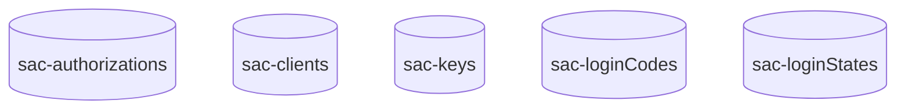

# Data Model - DynamoDB

The data model DynamoDB module provides an AWS [DynamoDB](https://aws.amazon.com/dynamodb/) implementation of the the data model interfaces so that the underlying implementation can be swapped out as a runtime dependency.

## Tables

The following tables are used by the DynamoDB data store:

### Table Schema

Each table uses a single partition key `pk` for efficient lookups. The `sac-authorizations` and `sac-keys` tables also require Global Secondary Indexes (GSIs) for querying by subject/audience and url respectively.

#### sac-authorizations Table

| Attribute | Type | Key |
| --------- | ---- | --- |
| pk | String | Partition Key |
| authorizationCreated | String | - |
| subject | String | GSI: subject-index (Partition Key) |
| audience | String | GSI: audience-index (Partition Key) |
| authorizedScopes | List<String> | - |
| locked | Boolean | - |

#### sac-clients Table

| Attribute | Type | Key |
| --------- | ---- | --- |
| pk | String | Partition Key |
| clientCreated | String | - |
| clientId | String | - |
| description | String | - |
| salt | String | - |
| clientType | String | - |
| clientSecret1 | String | - |
| clientSecret1Updated | String | - |
| clientSecret2 | String | - |
| clientSecret2Updated | String | - |
| availableScopes | List<Map> | - |
| jwtBearer | List<Map> | - |
| locked | Boolean | - |

#### sac-keys Table

| Attribute | Type | Key |
| --------- | ---- | --- |
| pk | String | Partition Key |
| url | String | GSI: url-index (Partition Key) |
| ttl | Number | TTL attribute for auto-expiration |
| valid | Boolean | - |
| kid | String | - |
| kty | String | - |
| alg | String | - |
| use | String | - |
| n | String | - |
| e | String | - |

#### sac-loginCodes Table

| Attribute | Type | Key |
| --------- | ---- | --- |
| pk | String | Partition Key |
| clientId | String | - |
| redirectUri | String | - |
| codeChallenge | String | - |
| userClientId | String | - |
| ttl | Number | TTL attribute for auto-expiration |

#### sac-loginStates Table

| Attribute | Type | Key |
| --------- | ---- | --- |
| pk | String | Partition Key |
| clientId | String | - |
| redirectUri | String | - |
| primaryState | String | - |
| primaryCodeChallenge | String | - |
| secondaryState | String | - |
| ttl | Number | TTL attribute for auto-expiration |

## Spring Boot Profile

Spring Boot 3's dependency injection is used to initialize the relevant Beans for interacting with DynamoDB. This is accomplished through profiles.

The `datamodel-dynamodb` profile is enabled to utilize AWS DynamoDB.

## Configuration

The following configuration attributes:

| Property                                     | Required                          | Description                 |
| -------------------------------------------- | --------------------------------- | --------------------------- |
| aws.region                                   | No (default: 'us-east-1')         | AWS Region                  |
| sac.datamodel.dynamodb.table.authorizations  | No (default: 'sac-authorizations')| DynamoDB table name         |
| sac.datamodel.dynamodb.table.clients         | No (default: 'sac-clients')       | DynamoDB table name         |
| sac.datamodel.dynamodb.table.keys            | No (default: 'sac-keys')          | DynamoDB table name         |
| sac.datamodel.dynamodb.table.logincodes      | No (default: 'sac-loginCodes')    | DynamoDB table name         |
| sac.datamodel.dynamodb.table.loginstates     | No (default: 'sac-loginStates')   | DynamoDB table name         |

## AWS Credentials

This module uses the AWS SDK default credentials provider chain. This means it will automatically look for credentials in the following order:

1. Environment variables (`AWS_ACCESS_KEY_ID` and `AWS_SECRET_ACCESS_KEY`)
2. Java system properties (`aws.accessKeyId` and `aws.secretAccessKey`)
3. Web identity token credentials from environment or container
4. Credential profiles file (`~/.aws/credentials`)
5. ECS container credentials
6. EC2 instance profile credentials

For production deployments, it is recommended to use IAM roles for service accounts (IRSA) when running in EKS, or instance profiles when running on EC2.

## Performance Considerations

- **Backward pagination**: The client listing functionality with backward pagination (`last` parameter) requires scanning all records. For large datasets, forward pagination (`first` parameter) is recommended for better performance.
- **TTL expiration**: DynamoDB TTL can be enabled on the `sac-keys`, `sac-loginCodes`, and `sac-loginStates` tables to automatically delete expired records.
