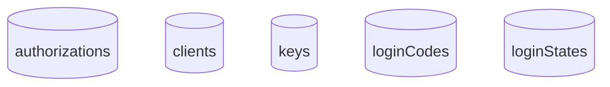

# Data Model - Firestore

The data model firestore module provides a GCP [Firestore](https://cloud.google.com/firestore) implementation of the the data model interfaces so that the underlying implementation can be swapped out as a runtime dependency.

## Collections

The following collections are used by the firestore data store:

## Spring Boot Profile

Spring Boot 3's dependency injection is used to initialize the relevant Beans for interacting with Firestore. This is accomplished through profiles.

The `datamodel-firestore` profile is enabled to utilize GCP Firestore.

## Configuration

The following configuration attributes:

| Property                                          | Required                       | Description               |
| ------------------------------------------------- | ------------------------------ | ------------------------- |
| google.cloud.project                              | Yes                            | GCP Project name          |
| sac.datamodel.firestore.database                  | No (default: '(default)')      | Firestore database name   |
| sac.datamodel.firestore.collection.authorizations | No (default: 'authorizations') | Firestore collection name |
| sac.datamodel.firestore.collection.clients        | No (default: 'clients')        | Firestore collection name |
| sac.datamodel.firestore.collection.keys           | No (default: 'keys')           | Firestore collection name |
| sac.datamodel.firestore.collection.logincodes     | No (default: 'loginCodes')     | Firestore collection name |
| sac.datamodel.firestore.collection.loginstates    | No (default: 'loginStates')    | Firestore collection name |
