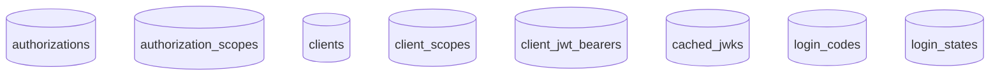

# Data Model - Postgres

The data model postgres module provides a [PostgreSQL](https://www.postgresql.org/) implementation of the data model interfaces so that the underlying implementation can be swapped out as a runtime dependency.

## Tables

The following tables are used by the PostgreSQL data store:



## Spring Boot Profile

Spring Boot 3's dependency injection is used to initialize the relevant Beans for interacting with PostgreSQL. This is accomplished through profiles.

The `datamodel-postgres` profile is enabled to utilize PostgreSQL.

## Configuration

The following configuration attributes:

| Property                              | Required | Description                        |
| ------------------------------------- | -------- | ---------------------------------- |
| spring.datasource.url                 | Yes      | PostgreSQL JDBC connection URL     |
| spring.datasource.username            | Yes      | Database username                  |
| spring.datasource.password            | Yes      | Database password                  |
| spring.jpa.hibernate.ddl-auto         | No       | Schema generation strategy         |

## Database Schema

The PostgreSQL implementation uses JPA/Hibernate for database interactions. The schema can be automatically generated using `spring.jpa.hibernate.ddl-auto=update` or you can create the tables manually using the following schema:

```sql
-- Authorizations table
CREATE TABLE authorizations (
    document_id VARCHAR(64) PRIMARY KEY,
    authorization_created VARCHAR(255),
    subject VARCHAR(255) NOT NULL,
    audience VARCHAR(255) NOT NULL
);

CREATE TABLE authorization_scopes (
    authorization_id VARCHAR(64) NOT NULL,
    scope VARCHAR(255),
    FOREIGN KEY (authorization_id) REFERENCES authorizations(document_id)
);

CREATE INDEX idx_authorizations_subject ON authorizations(subject);
CREATE INDEX idx_authorizations_audience ON authorizations(audience);

-- Clients table
CREATE TABLE clients (
    document_id VARCHAR(64) PRIMARY KEY,
    client_created VARCHAR(255),
    client_id VARCHAR(255) NOT NULL UNIQUE,
    description VARCHAR(255),
    salt VARCHAR(255) NOT NULL,
    client_type VARCHAR(50) NOT NULL,
    client_secret1 VARCHAR(255),
    client_secret1_updated VARCHAR(255),
    client_secret2 VARCHAR(255),
    client_secret2_updated VARCHAR(255),
    locked BOOLEAN
);

CREATE TABLE client_scopes (
    id BIGSERIAL PRIMARY KEY,
    client_id VARCHAR(64) NOT NULL,
    scope VARCHAR(255) NOT NULL,
    description VARCHAR(255),
    FOREIGN KEY (client_id) REFERENCES clients(document_id)
);

CREATE TABLE client_jwt_bearers (
    id VARCHAR(255) PRIMARY KEY,
    client_id VARCHAR(64) NOT NULL,
    jwks_url VARCHAR(255) NOT NULL,
    iss VARCHAR(255) NOT NULL,
    sub VARCHAR(255) NOT NULL,
    aud VARCHAR(255) NOT NULL,
    FOREIGN KEY (client_id) REFERENCES clients(document_id)
);

-- Cached JWKs table
CREATE TABLE cached_jwks (
    document_id VARCHAR(64) PRIMARY KEY,
    url VARCHAR(255) NOT NULL,
    ttl BIGINT NOT NULL,
    valid BOOLEAN,
    kid VARCHAR(255) NOT NULL,
    kty VARCHAR(255),
    alg VARCHAR(255),
    use_value VARCHAR(255),
    n TEXT,
    e VARCHAR(255)
);

CREATE INDEX idx_cached_jwks_url ON cached_jwks(url);

-- Login codes table
CREATE TABLE login_codes (
    document_id VARCHAR(64) PRIMARY KEY,
    client_id VARCHAR(255) NOT NULL,
    redirect_uri VARCHAR(255) NOT NULL,
    code_challenge VARCHAR(255) NOT NULL,
    user_client_id VARCHAR(255) NOT NULL,
    ttl BIGINT NOT NULL
);

-- Login states table
CREATE TABLE login_states (
    document_id VARCHAR(64) PRIMARY KEY,
    client_id VARCHAR(255) NOT NULL,
    redirect_uri VARCHAR(255) NOT NULL,
    primary_state VARCHAR(255) NOT NULL,
    primary_code_challenge VARCHAR(255) NOT NULL,
    secondary_state VARCHAR(255) NOT NULL,
    ttl BIGINT NOT NULL
);
```
