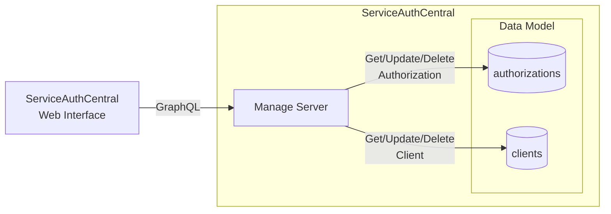

# Manage Server

The manage server provides the control plane for ServiceAuthCentral in the form of a GraphQL endpoint for managing the authorization server.

## Overview

The manage server provides a GraphQL endpoint providing the control plane for ServiceAuthCentral. This includes the ability to manage authorizations and clients.



## Build Manage Server Docker Image

Both the manage and token service are compiled from the same repository git repository and Dockerfile. The command to build the manage server requires the correct build-arg to be passed in to generate the docker container for the manage server components.

```bash
docker build -f Dockerfile --build-arg MAVEN_PROFILE=server-manage -t serviceauthcentral/server-manage .
```

## Run Manage Server Using Docker

The Docker image for the manage server is configured using environment variables.

!!! tip
    These properties are required to be identical between the manage and token server deployment.

| Property                 | Required | Description                                                                                                    |
| ------------------------ | -------- | -------------------------------------------------------------------------------------------------------------- |
| spring.profiles.active   | Yes      | A corresponding profile must be selected for [Data Model](../modules/datamodel/index.md)   |
| sac.issuer               | Yes      | The JWT issuer url. Typically the domain name of the token server.                                             |
| sac.cors.origins         | Yes      | CORS origins for web based logins. This is the domain name ServiceAuthCentral Web is deployed to.              |

## Authentication and Authorization

While the primary purpose of ServiceAuthCentral is server-to-server authentication with OAuth 2.0, this management API needs a mechanism to vend access tokens to the web based front end specifically [serviceauthcentralweb](https://github.com/UnitVectorY-Labs/serviceauthcentralweb). To support this server-token supports a PKCE login flow.

The tokens that are able to call the management API have the audience value which has the value of the issuer. Meaning in the JWT the issuer and audience have the same value.
