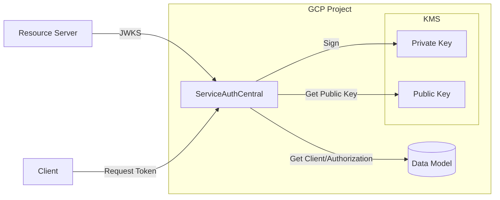

# Sign - GCP

The sign gcp module provides a [GCP KMS](https://cloud.google.com/security/products/security-key-management) implementation of the sign interface so that the underlying implementation can be swapped out as a runtime dependency.

## Overview

The benefit of using this module when running on GCP is that the KMS service is responsible for protecting the private key.  The private key is therefore able to be used for signing without being exposed to the application.

## GCP Configuration

This implementation only supports the `RSA_SIGN_PKCS1_2048_SHA256` signing algorithm.
Therefore the GCP KMS key must have a purpose of `Asymmetric sign` and an algorithm of `2048 bit RSA - PKCS#1 v1.5 padding - SHA256 Digest`.

## Configuration

This module is enabled by setting the `SPRING_PROFILES_ACTIVE` to include the profile `sign-gcp`.

The following environment variables are used by the GCP KMS module:

| Environment Variable               | Required             | Description                      |
| ---------------------------------- | -------------------- | -------------------------------- |
| GOOGLE_CLOUD_PROJECT               | Yes                  | GCP Project name                 |
| SAC_SIGN_GCP_KEY_RING              | Yes                  | KMS Key Ring Name                |
| SAC_SIGN_GCP_KEY_NAME              | Yes                  | KMS Key Name                     |
| SAC_SIGN_GCP_KEY_LOCATION          | No (default: global) | KMS Key Ring Location            |
| SAC_SIGN_GCP_CACHE_JWKS_SECONDS    | No (default: 3600)   | Length of time keys are cached   |
| SAC_SIGN_GCP_CACHE_SAFETY_MULTIPLE | No (default: 24)     | Multiple of cache before key use |

## Key Rotation and Caching Considerations

Public keys are retrieved from KMS and cached to avoid redundant API calls which may result in throttling.
The default amount of time for caching is 1 hour, but this can be configured using `sac.sign.gcp.cache.jwks.seconds`.

Due to this caching precautions must be taking when rotating keys.
KMS's built in ability to create and delete keys is utilized allowing multiple keys to be active at a time.
The problem arises when a new key is added, if it was immediately used for signing clients would not have the public key and would fail to verify it, therefore a period of time must elapse after it is created but before it can be used.

This period of time is configured using the `sac.sign.gcp.cache.safety.multiple` which has a default of 24 and is multiplied by `sac.sign.gcp.cache.jwks.seconds` whose default of 1 hour means that new keys will not be used for 1 day after they are created. The exception to this is when only 1 key is available, it will be use regardless of when it was created.

After this time elapses the key will be selected and used for signing and the older keys can be scheduled for deletion once any outstanding JWTs have also expired.

This procedure allows for key rotations without a production impact as long as clients are configured to not cache the JWKS response for longer than this configured
