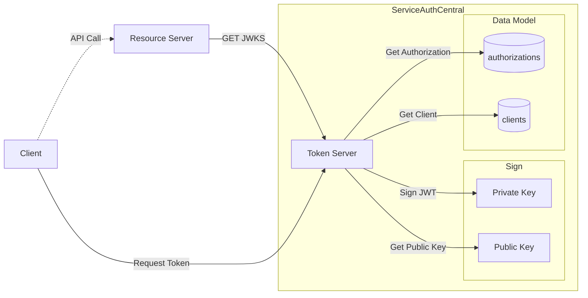

# Token Server

The token server provides the data plane for ServiceAuthCentral in the form of the token endpoint used to vend the JWT access tokens.

## Overview

The token server provides two major functions. First is providing the JWKS endpoint to resource servers. The public keys are retrieved from the specific implementation of the `sign` module. And the primary function is providing the OAuth 2.0 endpoint for clients to request access tokens which are returned in the form of JWTs.



## Build Token Server Docker Image

Both the manage and token service are compiled from the same repository git repository and Dockerfile. The command to build the token server requires the correct build-arg to be passed in to generate the docker container for the token server components.

```
docker build -f Dockerfile --build-arg MAVEN_PROFILE=server-token -t serviceauthcentral/server-token .
```

## Run Token Server Using Docker

The Docker image for the token server is configured using environment variables.

> {: .important }
> These properties are required to be identical between the manage and token server deployment.

| Property                                | Required | Description                                                                                                                                                                                                             |
| --------------------------------------- | -------- | ----------------------------------------------------------------------------------------------------------------------------------------------------------------------------------------------------------------------- |
| spring.profiles.active                  | Yes      | A corresponding profile must be selected for each of [Data Model]({{ site.baseurl }}) and [Sign]({{ site.baseurl }}). These are set as a comma separated list. |
| sac.user.redirecturi                    | Yes      | The redirect URI for serviceauthcentralweb; multiple values can be specified separated by commas                                                                                                                        |
| sac.issuer                              | Yes      | The JWT issuer url. Typically the domain name of the token server.                                                                                                                                                      |
| sac.cors.origins                        | Yes      | CORS origins for web based logins. This is the domain name ServiceAuthCentral Web is deployed to.                                                                                                                       |
| sac.server.token.external.cache.seconds | No       | Number of seconds external JWKS is cached. Default is 3600 seconds.                                                                                                                                                     |