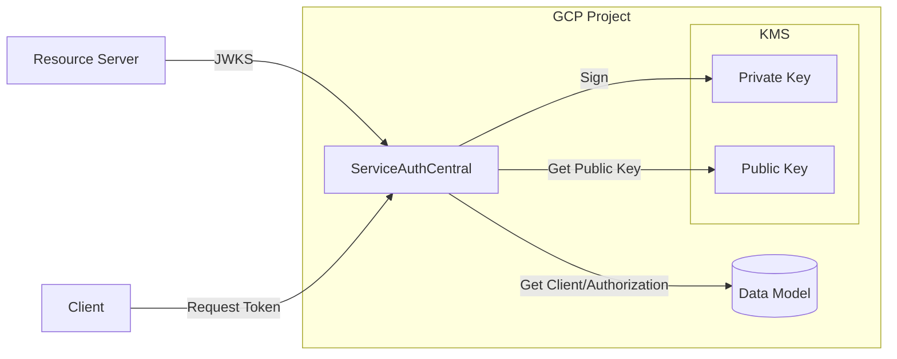

# GCP KMS

GCP KMS supports managing asymmetric keys for signing that are secured such that the private key is not accessable thereby providing additional protections.

# Configuration

This module is enabled by setting the `SPRING_PROFILES_ACTIVE` to include the profile `sign-gcp`.

The following environment variables are used by the GCP KMS module:

| Environment Variable               | Required             | Description                      |
| ---------------------------------- | -------------------- | -------------------------------- |
| GOOGLE_CLOUD_PROJECT               | Yes                  | GCP Project name                 |
| SAC_SIGN_GCP_KEY_RING              | Yes                  | KMS Key Ring Name                |
| SAC_SIGN_GCP_KEY_NAME              | Yes                  | KMS Key Name                     |
| SAC_SIGN_GCP_KEY_LOCATION          | No (default: global) | KMS Key Ring Location            |
| SAC_SIGN_GCP_CACHE_JWKS_SECONDS    | No (default: 3600)   | Length of time keys are cached   |
| SAC_SIGN_GCP_CACHE_SAFETY_MULTIPLE | No (default: 24)     | Multiple of cache before key use |
