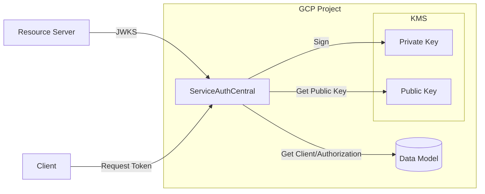

# GCP KMS

GCP KMS supports managing asymmetric keys for signing that are secured such that the private key is not accessable thereby providing additional protections.

```mermaid
flowchart LR
    subgraph gcpproject[GCP Project]
        ServiceAuthCentral

        subgraph KMS
            PrivateKey[Private Key]
            PublicKey[Public Key]
        end

        DataModel[(Data Model)]

        ServiceAuthCentral -- Get Client/Authorization--> DataModel

        ServiceAuthCentral -- Get Public Key--> PublicKey
        ServiceAuthCentral -- Sign --> PrivateKey
    end

    ResourceServer[Resource Server]
    ResourceServer -- JWKS --> ServiceAuthCentral

    Client -- Request Token --> ServiceAuthCentral
```
